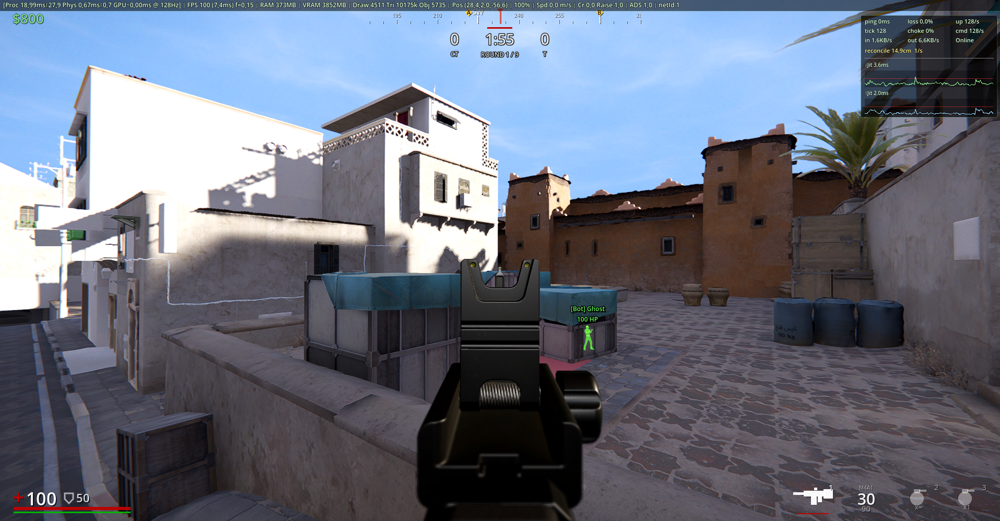

# ETA

> An open-source, server-authoritative tactical FPS built on Godot 4.6 and C#.

[]()
[](https://godotengine.org/)
[](https://dotnet.microsoft.com/)
[]()
[]()

<p align="center">
  
  
</p>

ETA is a competitive, round-based first-person shooter. **All game code is open source** and developed in the open in this repository. The project is **actively under development** — expect rapid iteration, breaking changes, and rough edges.

> **Asset notice:** game assets (art, audio, animations, FX, shaders, maps, props) are **not** released under the code license. See the [License](#license) section before reusing anything.

---

## Setting

ETA is a tactical **5-vs-5** multiplayer shooter set in a near-future present day where strategic infrastructure — data hubs, pipelines, satellite uplinks, private vaults — has slipped out of state hands and into the grip of private actors. When something is too valuable to defend openly and too dangerous to admit losing, **two off-the-books outfits** get the call:

- **VEKTOR** — a licensed private military force contracted to lock down high-value assets for corporate and government clients. They arrive first, dig in, and hold the line.
- **ATLAS-9** — a deniable strike network that hires out for operations that officially never happened. They breach hard, move fast, and leave before anyone can name the witnesses.

Every match is a single contract on a clock. The name *ETA* is the operators' word for that clock — the few minutes between insertion and the moment the world notices. Win or lose, the operation is wiped from every record before the smoke clears. Fast, surgical, and entirely off-grid.

The result is a round-based competitive shooter with classic tactical pacing — economy, callouts, smokes, flashes, retakes — fused with **fast-paced movement tech** (counter-strafe, wall-jump, wall-cling, slide, crouch-cancel-jump) and a **lightweight per-operator ability draft** that gives every match a slightly different shape without ever overriding gunplay.

---

## Status

**Pre-alpha — version `0.0.1`.** Core systems (networking, hit detection, weapon handling, movement, voxel smoke, settings) are end-to-end functional. Full game-mode logic (round economy, win conditions, buy menu), additional weapons and content polish are still in progress.

---

## Known Bugs

### LightmapGI not applied in exported release builds (Godot 4.6.3)

**Symptom.** The world renders correctly when launched from the editor (F5) — warm-beige Dust2 walls, properly shaded indoors, baked indirect light visible. The **same scene exported to a release build** (`build-windows.cmd`) renders washed out: walls and floor become near-pure white, distant geometry loses detail, sky clips to white. Auto-exposure exacerbates it but is **not** the root cause — turning AE off still leaves the release build over-bright. The viewmodel SubViewport (separate `WorldEnvironment`) is unaffected.

**Diagnosis (May 2026).** Bisected extensively. **Ruled out:**
- Custom `PostProcessEffect` Compositor pass (no-op'd, no change).
- `Settings.Brightness` and `settings.cfg` state (deleted, no change).
- SDFGI (not enabled in this scene).
- Auto-exposure alone (off in release still blown).
- Custom engine build flags — `production=yes` removed and full module strip removed, identical result.
- Custom export template vs. stock 4.6.3-stable template — both produce the same broken release.
- `directional=true/false` on the LightmapGI node — rebaked both ways, identical result.
- D3D12 vs. Vulkan rendering driver — both produce the same broken release.
- `shader_baker/enabled` toggle in the export preset.
- Texture-import format / BPTC packing — the `.bptc.ctexarray` is present in the PCK and loads successfully at runtime (verified via runtime diagnostic).
- The lightmap **data resource itself** is loaded into the `LightmapGI` node at runtime (confirmed via the `[lightmap-diag] data=OK` print in `Settings.DumpLightmapGIState`).

**Suspected cause.** Forward+ pipeline-selection or material-side gate that prevents the loaded `LightmapGIData` from actually being sampled in template_release engine builds. Editor-target (`target=editor`) builds work, template-target (`target=template_release`) builds do not, despite both being built from the same Godot 4.6.3-stable source. No `#ifdef TOOLS_ENABLED` gate found around the lightmap render path in a quick source audit, so the divergence is subtler. Related upstream issues: [godotengine/godot#107180](https://github.com/godotengine/godot/issues/107180), [#111125](https://github.com/godotengine/godot/pull/111125), [#73122](https://github.com/godotengine/godot/issues/73122) — none are a perfect match.

**Workaround.** None found yet. The lightmap loads but doesn't contribute. Tracking. Filing a Godot bug with a minimal-reproduction project is the next planned step.

---

## Table of Contents

- [ETA](#eta)
  - [Status](#status)
  - [Known Bugs](#known-bugs)
  - [Table of Contents](#table-of-contents)
  - [Features](#features)
    - [Networking \& Multiplayer](#networking--multiplayer)
    - [Movement](#movement)
    - [Combat \& Hit Detection](#combat--hit-detection)
    - [Weapons](#weapons)
    - [Grenades \& Smoke Voxel System](#grenades--smoke-voxel-system)
    - [Audio](#audio)
    - [Graphics \& FX](#graphics--fx)
    - [HUD](#hud)
    - [Settings](#settings)
    - [Bot System](#bot-system)
    - [Developer Tools](#developer-tools)
  - [Tech Stack](#tech-stack)
  - [Project Layout](#project-layout)
  - [Getting Started](#getting-started)
    - [Requirements](#requirements)
    - [Clone \& Build](#clone--build)
    - [Run](#run)
    - [Default Controls](#default-controls)
  - [Code Style \& Formatting](#code-style--formatting)
  - [Contributing](#contributing)
  - [Roadmap](#roadmap)
  - [Credits](#credits)
    - [Engine \& Libraries](#engine--libraries)
    - [Programming](#programming)
    - [Art \& Models](#art--models)
    - [Visual FX](#visual-fx)
    - [Audio](#audio-1)
    - [Shaders](#shaders)
    - [Special Thanks](#special-thanks)
  - [License](#license)
    - [1. Game Code — Open Source](#1-game-code--open-source)
    - [2. Game Assets — All Rights Reserved](#2-game-assets--all-rights-reserved)

---

## Features

### Networking & Multiplayer

**Transport & Protocol**
- **LiteNetLib UDP** transport with **two channels**: channel 0 unreliable (Input, Snapshot, ProjectileState), channel 1 reliable-ordered (Handshake, Shot, Hit, Death, Footstep, Jump, Land, GrenadeSpawn, ProjectileDespawn, SlotSwitch).
- **Protocol versioning** with mismatch → forced disconnect.
- **Wire-format quantisation**: yaw/pitch as `ushort`, position/velocity as cm-scale `int16` (snapshot size 6 B vs 12 B), 1-byte material ID table — every byte counts at 64 Hz.

**Tick Model**
- **128 Hz physics tick rate** (Jolt Physics), CLI-overridable (`--tickrate`, clamped 30..256).
- **64 Hz snapshot rate** (every second tick).
- **NetMain autoload** at `ProcessPriority = -100` so networking polls before the physics step.

**Client-Side Prediction & Reconciliation**
- 256-entry rolling **PredictionBuffer** stores per-tick state.
- Drift detection threshold scaled by velocity: reconciles when error > `0.02 + |vel|·dt`.
- **Visual error bleed** at `cl_recon_bleed_normal` (default 6.5/sec) for small drifts; large drifts use `cl_recon_bleed_large` (default 3.0/sec ≈ 333 ms decay) so rubber-band recoveries feel smooth instead of snappy.
- **Hard snap** above `cl_recon_snap_threshold_m` (default 5 m) — teleport-scale corrections still snap.
- **Spawn-settle window** (30 ticks) and **mantle reconcile block** prevent rubber-banding during transitions.

**Server-Side Lag Compensation**
- 128-tick **RewindBuffer** (1 s @ 128 Hz) of every hitbox transform.
- Hitscan replays at `currentTick − RTT/2 − InterpDelayTicks(6)`.
- RTT clamped to 0..64 ticks to prevent rewind exploits.
- Linear interpolation between stored ticks for sub-tick accuracy.

**Interpolation & Extrapolation**
- Remote puppets render with an **adaptive interpolation delay** clamped to `[cl_interp_min_ticks, cl_interp_max_ticks]` (default 3..12 ticks). The target tracks `JitterDownMs` so unstable networks get smoother puppets while LAN clients get lower delay. Competitive lock via `cl_interp_lock 6` matches the server's hardcoded lag-comp rewind exactly.
- Snapshot blending at the renderer side, not the simulation side.
- Server agents freeze until they receive their first input (no pre-spawn drift).

**Input Pipeline**
- **Input redundancy**: each client packet includes recent ticks; server dedupes via `LastInputTick`.
- **Edge-flag clearing** after consume (jump/fire/reload are one-shot, not held state).
- **Anti-cheat clamps**: `WishDir` magnitude > 1.1 triggers normalisation + violation counter; pitch clamped to ±π/2; server-derived `OnFloor/TouchingWall/WallNormal` (not trusted from client).

**Connection Lifecycle**
- **Identity tokens**: 16-byte GUID persisted to `user://settings.cfg`, server-assigned on first connect.
- **CLI override** `--identity` for testing multiple clients on one box.
- **Reconnect grace pool**: disconnected peers frozen for `--reconnect-grace` (default 600 s); same token resumes same NetId, position, kill/death counts.
- **Disconnect screen** with reason text + reconnect / quit buttons (`NetMain.RequestReconnect`).
- **4-phase loading screen** (Connecting → Handshaking → LoadingWorld → SwitchingScene), 15 s connect timeout, threaded `ResourceLoader` requests, branded progress bar.

**Modes**
- **Dedicated server** (`--server`) with headless visual-bypass. Binding controlled by `--host` (default `127.0.0.1`) and `--port` (default `27015`).
- **Listen server** (`--listen`) — host + play, same `--host` / `--port` defaults.
- **Client** — the default mode when no flag is passed. Boots into the **main menu** (see below).
- **Client with auto-connect** (`--connect HOST:PORT`) — skips the main menu and connects directly.
- **Game modes**: `--gamemode dm | competitive`.
- See [Getting Started → CLI Arguments](#cli-arguments) for the complete flag reference.

**Main Menu** *(planned)*
- The client **does not** boot straight into a loading screen any more — it boots into a small main menu first.
- **Server connect** widget: IP + port input field (placeholder `127.0.0.1:27015`) → **Connect** button → triggers the loading flow.
- **Settings** widget: the same in-game settings menu (graphics / display / controls), so video options can be tuned **before** the world loads.
- **Quit** button.
- The menu is **skipped only** when `--connect HOST:PORT`, `--listen` or `--server` are passed on the command line.

**Network Telemetry**
- `NetStats` static struct sampled at 500 ms.
- Tracks BytesPerSec up/down, packet loss %, ping, server-tick estimate, jitter up/down (ms), reconciles per second, last reconcile drift (m).
- Visualised via the in-game NetGraph overlay.

**Packet Types** (defined)
ConnectRequest · SpawnAck · PlayerJoined · PlayerLeft · ShotFired · Footstep · Jump · Land · Hit · Death · Respawn · GrenadeSpawn · ProjectileState · ProjectileDespawn · Inspect · SlotSwitch · SlideStart · SlideEnd · ServerLog · RoundState (reserved) · DryFire (reserved)

**Anti-Wallhack**
- `Hit` packets are **unicast** to shooter + victim only (no broadcast of hit positions).
- **Fog of War** (Valorant-style voxel-PVS) — see next subsection.

**Fog of War (Voxel-PVS Occlusion)**

Server-side line-of-sight culling: enemies behind walls are not in the client's snapshot at all, and their position-leaking event broadcasts (shots, footsteps, jumps, lands) are gated by the same PVS. Kills the ESP/wallhack cheat category entirely. Teammates and self are always visible regardless of LOS.

- **Voxel grid**: map is voxelised into a coarse 3D grid (default 4 m cells, auto-coarsened to stay under the per-path voxel cap). Pairwise visibility between every voxel pair is determined via a single center-to-center physics raycast.
- **O(1) runtime lookup**: `VoxelPvs.CanSee(from, to)` is a single bit-test against a flat `byte[]` — cheap enough to gate every snapshot and every event broadcast without measurable cost.
- **Solid-voxel pre-pass**: a one-shot point-overlap query per voxel flags voxels whose center sits inside collision geometry (walls/floor/ceiling). Pair-tests involving solid voxels are skipped — typically 50–80 % of voxels on a fully-collidered map, so bake time drops to ~20 % of the naïve case.

**Baking (offline, recommended)** — modelled after Godot's own `VoxelGI` / `LightmapGI`:

1. Open the map `.tscn` in the editor.
2. Add a `VoxelPvsInstance` node (registered globally via `[GlobalClass]`, appears in the **Add Child Node** dialog).
3. Tune inspector properties as needed (`BakeVoxelSize`, `OccluderCollisionMask`, optional `UseOverrideAabb` for manual AABB control).
4. Click **Bake PVS**. The raycast pass runs **incrementally in `_Process`** (`BakeRaysPerFrame` controls editor responsiveness vs. bake speed) — the editor stays usable, `BakeStatus` shows live percentage, the Output panel logs every 5 %.
5. **Cancel Bake** button aborts mid-bake without touching the previous `Data` resource.
6. On completion the bake writes a `<scene>.pvs.tres` next to the .tscn and assigns it to the `Data` slot. Save the scene.

At server start, `NetServer.TryBuildVoxelPvs` looks for a `VoxelPvsInstance` in the loaded scene. With baked `Data` present, `VoxelPvs.LoadFromData` adopts the resource's byte buffer **by reference** (zero copy, zero allocation, FoW active from tick 1, no first-start freeze). With no `Data`, falls back to an **incremental runtime build** at 1000 rays/Poll (~25 s wall-clock at the default voxel cap) — the same incremental pipeline the editor bake uses, just bounded smaller.

**Editor gizmo**
- **Bake AABB** — yellow wireframe (orange before bake) showing the voxel grid extents.
- **Voxel grid** — `ShowVoxelGrid` toggles blue per-cell lines on top.
- **Density heatmap** — `ShowDensityHeatmap` renders one small cube per playable voxel, HSV-colored by visibility ratio: 🔴 red = enclosed (FoW filters a lot here) → 🟡 yellow = mid → 🟢 green = open. Solid voxels skipped. MultiMesh-backed so even 16 k voxels render in one draw call.
- **Largest-collider diagnostic** — bake logs the top 8 largest collision shapes contributing to the auto-AABB, so if a skybox / death-plane is inflating the bounds you can immediately see which node to re-layer.

**Cross-process diagnostic log** (`ServerLog` packet) — server-side FoW events (build start, progress every 5 %, completion, per-5 s "FoW activity" report) are reliable-broadcast to all connected clients and printed in their stdout + in-game `ConsoleHud` panel with a cyan `[SV]` prefix. Useful when server and client run as separate Godot processes whose stdouts the user is not all watching.

**ConVars**
- `sv_fog_of_war` (default `false` — opt-in until tested per map) — master toggle.
- `sv_fow_voxel_size` (default `4` m) — runtime-build voxel size; editor bake overrides via `VoxelPvsInstance.BakeVoxelSize`.

---

### Movement

**Ground Physics**
- Walk 5.0 / Sprint 6.0 / Shift 1.9 / Crouch 1.9 m/s.
- Ground accel 60, ground friction 50, gravity 17.5, jump 4.95 m/s.
- Air accel 100, air-max-wishspeed 0.6 (for strafe control without infinite gain).
- **Counter-strafe** — opposing input instantly cancels velocity.

**Jump Techniques**
- **Coyote time** 100 ms.
- **Jump buffer** 80 ms.
- **Crouch-jump buffer** 150 ms with forward-speed bonus (scales 0..0.65 from horiz 3..6 m/s).
- **Crouch-cancel-jump tech** — precise Ctrl press 60–180 ms after jump grants +1.85 m/s vertical, one-shot per airtime.
- **Apex-hang gravity** modifier (per-weapon tunable mul).

**Wall Tech**
- **Wall jump** — requires ≥5.5 m/s horizontal, keeps 65% momentum, blends 65% look-weight, one per airtime (resets on land).
- **Wall cling** — sprint + jump into wall freezes you for 1.25 s; one charge per airtime; exit-jump bypasses the speed floor.

**Slide**
- Crouch during sprint at ≥5.5 m/s → boost to 9 m/s, friction 6, max 1 s.
- Ends on slow / crouch-release / airborne.
- **Slide-stop accuracy window** (200 ms, 0.5× spread multiplier) — rewards stopping precisely before shooting.
- Optional hard-brake.

**Stamina**
- Max 100, drain 18.5/s, regen 20/s after 0.5 s delay.
- 1 s exhaust timeout; sprint resume threshold = 10.

**Stance & Transitions**
- Crouch transition speed 5/s with capsule resize + eye-height lerp.
- **Auto-mantle** — crouch + airborne + forward input triggers a 0.35 s smoothstep climb onto obstacles 1.0–1.75 m high (3 forward probe offsets).
- **Step-up** ladder bumps before `MoveAndSlide`.

**Breath Hold**
- 3-phase: hold 3 s → recover 1 s → cooldown 0.5 s.
- While held: sway ×0.2, breathing ×0.45, spread ×0.7.
- During recover: sway ×2.2, spread ×1.45 (penalty for overuse).
- Per-spawn timer.

**Weapon Raise Gate**
- Sprint→fire requires `WeaponRaiseBlend ≥ 0.8` (raise 200 ms / lower 60 ms) — no instant ADS out of full sprint.

---

### Combat & Hit Detection

**Server-Authoritative Hitscan**
- Rewound to the shooter's view tick; multi-RID exclude (shooter body + own hitboxes).
- **Per-bodypart damage**: head 140 / chest 33 / waist 36 / leg 27 / foot 20 (M4A1).

**Hitbox Rig**
- Scans `Skeleton3D` for `Hitbox` children; falls back to a default set (head sphere, chest/waist/arm/leg/calf/foot capsules).
- **Auto-orients capsules** from bone-to-child vectors (no manual placement needed for sensible rigs).
- Hitbox **layer 3** is separate from the ServerAgent body **layer 5** — no cross-push.

**Armor / Kevlar**
- 50 cap, body hits split 50% armor / 50% HP, head shots bypass armor.
- **No regen** for armor (depleted = depleted until next round / pickup).

**HP Regen** (configurable)
- 8 s delay after damage, then +1 HP per 80 ms up to 100.
- Tuned to be ~2× slower than typical AAA shooters.

**Spread & Recoil**
- **Deterministic per-weapon recoil pattern** (M4A1 = 30-entry array, pattern resets after 0.35 s idle).
- **Exponential bloom** (`HipfireBloomCurve`, 8-shot saturate, ADS bloom ×0.1).
- **Movement spread** in 3 tiers (shift / walk / sprint).
- **Airborne spread** ×2.5 (replaces ADS bonus when in the air).
- **AimPunch** vector with per-weapon max-climb clamp (±4.5°), recovery 3/s firing, 18/s released.
- **Per-tick deterministic RNG** seeded by `tickIndex * 2654435761 ^ shotIndex * 40503` — every player sees identical spread for the same shot.

**Weapon State**
- Magazine + reserve ammo (M4A1: 30 + 90), reload timer (2.6 s).
- Inspect animation gate — blocks ADS during inspect.
- Dry-fire detection (empty mag click).
- Single-shot vs full-auto via `FireMode`.

**ADS (Aim Down Sights)**
- Per-weapon FOV (M4A1 = 60°).
- Sensitivity multiplier 0.5, movement multiplier 0.65, spread multiplier 0.15.
- Blend time 0.18 s, kick multiplier 0.08.
- Pos / rot offsets and crouch-additive correction per weapon.
- Optional **ADS DoF** and **ADS FOV-zoom** (Settings).

**Feedback**
- **Bullet tracers** — true travelling cylindrical streaks (not static beams), per-Nth-shot configurable.
- **Per-face surface detection** — face-index → mesh surface → material → `impact_tag` metadata.
- **Bullet impact manager** — Decal3D + GPUParticles3D per material set (metal / wood / concrete / glass / default) with distance fade, random scale + rotation.
- **HitFeed** — shooter→part→victim list, 8 entries, 4 s hold + 1.5 s fade.
- **Killfeed** — Death packet carries `weaponId` + headshot flag for client UI.

---

### Weapons

**Per-Weapon Architecture**
- Every weapon is a `.tscn` scene with a `Weapon.cs` script.
- **WeaponStats** records hold 40+ tunables: fire rate, recoil pattern array, bloom curve, ADS offsets, weapon-kick spring (stiffness/damping), finger-kick Z, audio clip arrays per layer, ADS FOV, audio crossover distance.

**Visual Components**
- Muzzle marker + 3 `GPUParticles3D` (flash / smoke / sparks).
- Ejection-port marker for shell pool.
- `AnimationTree` for arm anims.
- **ADS test mode** to preview alignment in-editor.
- **Muzzle light** (color / energy / range / duration).
- **Configurable tracer rate** (every Nth shot).
- **Shell pool** (pooled rigid-body ejection).

**Weapon Audio (layered)**
- 4 layers per shot: **Body / Mech / Tail / Distant**.
- Phase-coherent pitch roll (small random pitch ±0.06).
- **Distance crossover** — switches to distant variant after `DistantCrossoverM` (28 m for M4A1).
- **3D positional** for remotes via `AudioStreamPlayer3D`.
- **Occlusion** — raycast → low-pass + volume duck.
- **Environment-adaptive reverb buses** — outdoor / indoor / tunnel chosen via ceiling raycast + `tunnel` floor group.
- **Threaded async clip loading** with process-wide static cache.

---

### Grenades & Smoke Voxel System

**Voxel Smoke Field** (the showcase system)
- Grid: voxel size 0.6 m, domain ~13.8 × 5 × 13.8 m → ~23 × 9 × 23 cells.
- **One-time BFS flood-fill** + **cell-to-cell raycast** for wall connectivity → smoke can't seep through geometry.
- **Per-tick advection** with configurable wind (default 0.13 / 0 / 0.08) and buoyancy (0.5).
- Diffusion 0.8, dissipation 0.018 (height-scaled), 30 Hz bake to 3D R8 texture.
- Custom `FogVolume` shader with FBM billowing noise for organic detail.
- Burn time 24 s.

**Shot Disturbance**
- Bullets passing through smoke clear a 1 m radius channel for 0.3 s along the shot path, then refill deterministically.

**Line-of-Sight Integration**
- Segment density integration `1 − exp(−od·DensityMul) > 0.65` blocks bot vision and (future) AI checks.
- Deterministic — server and clients evaluate identically.

**Cloud-Shadow Integration**
- The cloud-shadow shader is fed up to 40 active smoke density textures + AABBs per frame to **mask out smoke-shadowed pixels** (no ugly cloud-shadow stripes inside smoke).

**Deterministic Projectile**
- Shared `GrenadeTrajectory.Advance` used by both the live grenade and the aim preview.
- Fixed dt 1/128, gravity-scaled, restitution 0.35, bounce friction 0.65, ground drag 7.
- Rest detection: 1 m/s for 0.18 s.
- Max fly 5 s.

**Throw Model**
- Min / Max throw speed 6 / 18.5 m/s.
- Up-bias 0.25, velocity inheritance 0.6.
- Charge-to-full 0.7 s, min charge 0.12.

**Aim Guide**
- `ImmediateMesh` ribbon + `TorusMesh` landing ring rendered in world-space using identical physics — what you see is what you throw.

**Replication**
- Owner sends `ProjectileState` every 4th tick (unreliable) + reliable `GrenadeSpawn` / `ProjectileDespawn`.
- Puppets lerp toward target at 16/s, snap if > 2 m off.
- **NetId rewritten server-side** on relay (anti-spoof).

---

### Operator Abilities

> **Design — in active development.** Spec locked, gameplay implementation in progress.

**Smoke and flash grenades are standard kit for every operator** — they are *not* abilities. Anyone can carry and throw them, the same way anyone can carry a rifle. Abilities are a separate, **lightweight tactical edge** layered on top.

Each match every operator picks **one ability** from a shared pool during the pre-round loadout screen. **Abilities are unique per match** — once a teammate or enemy locks an ability, no one else can take it that round. With **11 abilities** on offer and 10 slots filled across both teams (5v5), one is always left on the bench, forcing teams to read the meta and counter-pick. All abilities give **one charge per round**.

The design intent is **Valorant-style operator flavor with a deliberately small footprint**. The kit reads like a tactical loadout — placed tools, throwables, scans, short self-buffs — so each pick gives the operator a clear *identity* without any single ability ever warping the round. No game-winning ultimates, no invisibility, no holograms, no deployable shields, no resurrection, no team-wide buffs.

| # | Ability             | Type                | Effect                                                                                                                |
|---|---------------------|---------------------|-----------------------------------------------------------------------------------------------------------------------|
| 1 | **Sprint Surge**        | Self · movement     | +25% sprint speed for **3 s**. Instant, single charge.                                                                    |
| 2 | **Recon Wire**          | Placed · trap/info  | Invisible monofilament across a chokepoint. When crossed, **tags the enemy for the team for 4 s** (no damage; soft click on trigger). Defuse-able. |
| 3 | **Pulse Scan**          | Active · info       | Single radar ping in a **6 m sphere**; reveals enemies for **1.5 s**. Single charge.                                      |
| 4 | **Stim Patch**          | Self · support      | Inject: +30 HP regen over **3 s**. 0.6 s no-fire lockout during application.                                              |
| 5 | **Spotter Drone**       | Throwable · info    | Hand-sized drone that hovers where it lands and **spots the first enemy** that enters a 12 m cone for 6 s. Destructible (50 HP). |
| 6 | **Ammo Cache**          | Placed · support    | Drop a small refill kit on the ground; **refills 1 magazine** for any teammate (or yourself) who steps on it.             |
| 7 | **Sound Decoy**         | Throwable · deception| Sticks where it lands and plays **looping footstep audio** for **4 s** — fakes a push, fools radar and ears. Audible 12 m. Destructible. |
| 8 | **Heartbeat Sensor**    | Equip · info        | Pull out and scan for **5 s**: any enemy within **5 m** appears as a directional dot on your HUD. You can't fire while it's out. |
| 9 | **Brace**               | Self · defensive    | Activate: incoming bullet damage **−25% for 1.5 s**. Cannot fire while bracing.                                           |
| 10| **Steady Aim**          | Self · utility      | Your next shot has **0 spread and zero recoil kick**. Single charge, consumed on the next trigger pull.                   |
| 11| **Long Breath**         | Self · utility      | Your next breath-hold lasts **2× as long**. Single charge.                                                                |

**Why "one per match" matters:** abilities double as draft-pick information. A team locking Brace + Trip Alarm early is signalling a defensive hold; a squad pulling Sprint Surge + Quick Hands + Steady Aim is telegraphing an aggressive entry. Every round has a different ability spread on the board, so the meta is re-rolled every match.

**Counter-balance rules:**
- No ability deals direct damage. Every kill still requires gunplay.
- All abilities can be dodged, defused, ignored, or out-positioned — none of them auto-win a duel.
- An operator who dies with an unused charge does **not** drop a pickup — the ability is spent for the round.
- Effects that compete with bullets (heal, brace) are server-authoritative on the same rewind pipeline as hitscan; no client-side fakery.

---

### Audio

**Footsteps**
- Per-material clip pool from folder structure: `codebase/audio/footsteps/<material>/...`.
- **33 supported materials** — concrete, metal, wood, glass, gravel, dirt, sand, mud, grass, ice, snow, carpet (hard/wood), water (shallow_wet / deep), leaves, broken_glass-on-X variants, plus `_2` alternates.
- **Distance-based cadence** (deterministic per-tick): stride 2.05 m, sprint mul 0.82, crouch mul 1.25, initial-step fraction 0.7.
- **Per-stance loudness**: shift 0.12 / walk 0.62 / sprint 1.0; crouch ×0.45.
- **3D positional** for remotes (min 11 m / max 46 m hear distance, unit size 9).
- **Occlusion** via raycast → 720 Hz low-pass + −7 dB.
- **Tunnel reverb bus** triggered by `tunnel` floor group (room 0.75, wet 0.45).
- Async clip loading with process-wide cache and preload list.

**Weapon Audio**
- Per-bus mix: Mech −8 dB, Tail −5 dB.
- Outdoor wet 0.18 / Indoor wet 0.45 / Tunnel wet 0.7.
- Per-shot pitch randomness ±0.06.

---

### Graphics & FX

**Renderer**
- Forward+ (Vulkan / D3D12), .NET 8 C#.
- 128 Hz physics with TAA-friendly tick.

**Post-Process Compositor** (custom GLSL compute, `post_process.glsl`)
- Heat haze
- Chromatic aberration (0.0026)
- Sharpening (0.25)
- Vignette (0.18 + 0.15 ADS boost)
- Film grain (Simple / FilmGrain / FilmGrain2 modes)
- Motion blur (strength 3.0)
- All passes individually toggleable.

**Anti-Aliasing**
- FXAA / SMAA / TAA (MSAA intentionally absent — incompatible with the screen-space compositor).
- **FSR 1 / FSR 2** upscaling when `RenderScale < 1`.

**Lighting & Shadow**
- Shadow quality presets Low (1024) / Medium (2048) / High (4096) atlas + soft-shadow filter tiers.

**Atmosphere**
- **Volumetric fog** (always on — smoke voxel system depends on it).
- **Cloud shadows** with configurable distance LOD (60 / 80 / 150 m presets), smoke-masked.
- **God rays**, **lens flare**, **dust motes** as Node3D groups under the map root.
- Sky background with cubemap cache and live restoration.

**Viewmodel**
- **ViewmodelLightSampler** — 3-source mix (sun raycast, sky raycast, ambient material-albedo raycasts) re-lights the FPS arms DirectionalLight to match the world.
- **Strict rendering layer convention** (`Layer 1` = world, `Layer 2` = FPS viewmodel) keeps arms out of world shadows and vice-versa.

**Decals & Particles**
- `BulletDecalSet` resource with auto-packed ORM (separate O/R/M → packed at load), optional Opacity merge into Albedo.A, max-resolution clamp.
- Pooled shell ejection.

**Third-Person**
- `TpsAimModifier` — world-space spine twist + pitch SkeletonModifier3D, rig-orientation-independent.
- `TpsFootIk` — TwoBoneIK3D + per-foot ground-snap raycast (ground adaptation, not procedural stepping yet).

**Misc**
- `PushableObject` — RigidBody3D with push-charge mechanic and a 2D prompt UI.

---

### HUD

- **Main HUD** — top compass + score row + round + timer + bomb banner; bottom-left vitals (health / armor / stamina); top-left money; bottom-right loadout.
- **Compass** — 360° strip with 5° / 15° / 45° ticks + cardinals + **bombsite A/B markers** from `bombsite_a` / `bombsite_b` groups.
- **Scoreboard** (Tab) — 4 Hz refresh, name / K / D / ping from `LastSelfSnap` + `LastRemoteSnapshots`.
- **HitFeed** — shooter → part → victim, −DMG / HP, 8 entries.
- **Hitmarker**, **Killfeed**, **LowHP FX** — stacked CanvasLayers auto-attached at local-player spawn.
- **Dynamic crosshair** — kick-on-fire, per-frame recovery 16/s, ADS hide, all ConVar-driven (gap / length / thickness / outline / color).
- **HudVitals**, **HudWeaponSlots** — custom-drawn widgets.
- **Runtime-tunable HUD margins** (`HudMarginH/V`) applied live to all corner-anchored widgets.

---

### Settings

Persisted to `user://settings.cfg`.

**Display**
- WindowMode, Resolution (per-monitor filtered list), VSync, FpsCap, **MenuFpsCap** (separate cap to cool the GPU while in menus), Brightness.

**Graphics — Quality Preset** (Low / Medium / High / Custom)
- RenderScale + Upscale mode (FSR1 / FSR2 / Bilinear).
- AntiAliasing (Off / FXAA / SMAA / TAA).
- Shadow quality (Low / Medium / High).
- AmbientOcclusion, Reflections (SSR), VolumetricFog (forced on), Sky.
- CloudShadows + Distance.
- GodRays, LensFlare, DustMotes.
- MotionBlur, FilmGrain, Vignette.
- AdsDepthOfField, AdsFovZoom.

**Camera Feel**
- ViewBob, SprintSway, MouseInertia, DirectionLean, CameraShake.

**Input**
- MouseSensitivity, Fov.

**HUD**
- HudMarginH, HudMarginV.

**Diagnostics**
- ShowDebugBar, ShowNetGraph.

**Headless Server Bypass**
- In dedicated-server mode, all visual toggles are force-overridden to off **before** the world is loaded, then `Settings.Apply` strips the env resource live once `world.tscn` is active — no GPU work for the dedicated server.

---

### Bot System

- CLI flag `--bots N` — server fills `N` agent slots.
- Bot names pulled from a 22-entry pool, prefixed `[Bot]`.
- **Alternating CT / T team balance** so bot fills never lopside.
- **Replaceable by real joiners** — when a human connects and a bot slot is the next free, the bot is removed and the player takes their place.
- Bots run as full `ServerBotPlayer` agents inside the same simulation as real players.

---

### Developer Tools

**In-Game Console** (`F10` or `^`)
- Drop-down developer console for live server- and client-side configuration.
- Two scopes by naming convention:
  - `sv_*` — **server commands**. Effect is server-authoritative and broadcast to all clients (works on dedicated, listen, and integrated host).
  - `cl_*` — **client commands**. Effect is local to the player who typed it.
- Tab-completion against the ConVar registry, command history (`↑` / `↓`), and `?` / `list` to enumerate matches.

Example commands:

| Command                  | Scope    | Effect                                                                                |
|--------------------------|----------|---------------------------------------------------------------------------------------|
| `sv_debug_hitboxes 1`    | server   | Server broadcasts hitbox state → **all clients** see red hitbox markers on every player. |
| `sv_debug_capsule 1`     | server   | **All clients** see red body capsules on every player.                                    |
| `sv_debug_aimray 1`      | server   | Each client renders **their own** yellow aim-ray (server-authoritative trace).            |
| `cl_debug_hitbox 1`      | client   | **Only you** see green puppet hitbox wireframes for the remote players around you.        |

**ConVars System**
- Runtime-tunable string-keyed registry, edited via the console (`set name value` or just `name value`).
- **SvConVars** — ~80 server-side fields (movement, jump, wall, slide, breath, stamina, footsteps, grenades, debug toggles).
- **ClConVars** — ~95 client-side fields (sensitivity, FOV, sway, bob, lean, mouse-inertia, lower-idle, sprint-lower, crouch-weapon, jump-kick, wall-pushback, crosshair, debug overlays).
- Per-weapon scoped overrides (e.g. M4A1 recoil pattern is a ConVar table).
- Reflection-driven `TrySet/Get/List` parses float / int / bool.

**DebugOverlay** (`Settings.ShowDebugBar`)
- Top bar: smoothed process / physics ms + 1 s peak-windows.
- FPS with 1 s rolling min.
- RAM / VRAM / draw call / object counters.
- Player pos / state / stamina % / speed / crouch / weapon raise / ADS / NetId.

**NetGraphOverlay** (`Settings.ShowNetGraph`)
- 3×3 metric grid: ping, loss, up-pps, tick, choke, cmd-pps + reconcile-drift (cm + reconciles/s, color-coded green / yellow / red).
- Two jitter line-graphs (down green / up blue), 120-sample ring, 20 ms Y-axis, 10 ms threshold line.

**`Dbg`**
- Central debug-print gate via `ProjectSettings("global/debug")`.

**`InputGate`**
- Blocks input when the settings menu is open, when the window loses focus (Alt-Tab), or when local HP = 0 (dead → respawning).

**Spawn System**
- Marker groups `spawn_ct` / `spawn_t` / `spawn_deathmatch` with name-suffix fallback.
- Spawn-occupancy collision avoidance (1 m free radius), ground-snap raycast (+5 cm).
- Auto-respawn countdown 5 s.

**Editor Integration**
- `Hitbox` is `[Tool, GlobalClass]` — placeable directly in the editor scene tree.

---

## Tech Stack

| Layer            | Choice                                                  |
|------------------|---------------------------------------------------------|
| Engine           | [Godot 4.6](https://godotengine.org/) (Forward+)        |
| Language         | C# (.NET 8.0)                                           |
| Physics          | Jolt Physics @ 128 Hz                                   |
| Networking       | [LiteNetLib 2.1.4](https://github.com/RevenantX/LiteNetLib) |
| Renderer Driver  | Direct3D 12 (Windows)                                   |
| Formatter        | [CSharpier 0.30](https://csharpier.com/)                |

---

## Project Layout

```
.
├── codebase/                  C# source — all game logic
│   ├── authority/character/   Local / Puppet / Server / Bot player split
│   ├── audio/                 Footstep audio mapped by surface tag
│   ├── debug/                 DebugOverlay, NetGraphOverlay
│   ├── fx/                    Post-process, smoke voxels, tracers, decals
│   ├── hud/                   Crosshair, hit-feed, scoreboard, vitals
│   ├── net/                   Client / server, prediction, rewind, packets
│   ├── settings/              Settings + in-game menu
│   └── weapons/               Weapon.cs (per-weapon .tscn lives in /weapons)
├── character/                 Player mesh, anims, textures, materials
├── fx/                        FX assets (audio, decals, LUT, muzzle, sky, smoke)
├── maps/                      dust2, warehouse
├── props/                     Ammo, barrels, vehicles, environmental
├── weapons/                   Weapon scenes (.tscn)
├── tools/                     Editor tools and utilities
├── loading.tscn               Main scene (boot → load → connect)
└── world.tscn                 In-game world container
```

---

## Getting Started

### Requirements
- **Godot 4.6** with .NET / Mono support
- **.NET 8 SDK**
- Windows (the project currently builds with the D3D12 driver — Linux/macOS untested)

### Clone & Build
```bash
git clone <your-repo-url> eta
cd eta
dotnet tool restore          # installs csharpier (local tool)
```

Open the folder in Godot, let it generate the `.godot/` cache, then **Build** (hammer icon) to compile the C# assembly.

### Run

| Scenario                                   | Command                                                       |
|--------------------------------------------|---------------------------------------------------------------|
| Boot to the main menu (default)            | `godot` / double-click the exe                                |
| Dedicated server on default `127.0.0.1:27015` | `godot -- --server`                                       |
| Dedicated server on a custom address       | `godot -- --server --host 0.0.0.0 --port 28000`               |
| Listen server (host + play, dev shortcut)  | `godot -- --listen`                                           |
| Client, auto-connect to a server           | `godot -- --connect 10.0.0.5:27015`                       |
| Dedicated with 5 bots and a custom tick    | `godot -- --server --bots 5 --tickrate 64`                    |

Reconnect after a transport drop is handled automatically by `NetMain.RequestReconnect`.

### CLI Arguments

| Flag                          | Default       | Description                                                                                              |
|-------------------------------|---------------|----------------------------------------------------------------------------------------------------------|
| `--server`                    | —             | Run as **dedicated headless server**. Combine with `--host` / `--port`.                                  |
| `--listen`                    | —             | Run as **listen server** (server + local client in one process). Combine with `--host` / `--port`.       |
| `--connect HOST:PORT`     | —             | Run as **client and connect directly** to the given address, skipping the main menu.                     |
| `--host HOST`                 | `127.0.0.1`   | Bind hostname / IP for `--server` and `--listen`.                                                        |
| `--port PORT`                 | `27015`       | Bind port for `--server` and `--listen`.                                                                 |
| `--max-players N`             | `16`          | Maximum simultaneous players, clamped to `1..64`.                                                        |
| `--bots N`                    | `0`           | Number of AI bots the server auto-spawns. Bots are replaced as real players join.                        |
| `--name "NAME"`               | `Player`      | Display name used for the local player.                                                                  |
| `--tickrate N`                | `128`         | Server physics tick rate (Hz), clamped to `30..256`.                                                     |
| `--gamemode dm \| competitive` | `competitive` | Game mode preset.                                                                                       |
| `--reconnect-grace SECONDS`   | `600`         | Time a disconnected peer is preserved on the server so the same identity token can resume.               |
| `--identity TOKEN`            | —             | Override `Settings.NetIdentityToken` (used only for testing multiple clients on the same machine).       |

> Godot separates user arguments from engine arguments with `--`. Always put game flags **after** `--`, e.g. `godot -- --connect 10.0.0.5:27015`.

### Default Controls
| Action       | Key                |
|--------------|--------------------|
| Move         | `W` `A` `S` `D`    |
| Sprint hold  | `Shift`            |
| Run toggle   | `X`                |
| Jump         | `Space`            |
| Crouch       | `Ctrl`             |
| Fire         | `LMB`              |
| ADS / Zoom   | `RMB`              |
| Reload       | `R`                |
| Inspect      | `F`                |
| Hold breath  | `Q`                |
| Slot 1 / 2   | `1` / `2`          |
| Use / Action | `E`                |
| Scoreboard   | `Tab`              |
| Menu         | `Esc`              |

---

## Code Style & Formatting

The project enforces a strict code style through [CSharpier](https://csharpier.com/). VSCode is configured to format on save.

```bash
dotnet csharpier codebase           # format every .cs file
dotnet csharpier --check codebase   # check without writing (CI / pre-commit)
```

VSCode tasks (`Ctrl+Shift+P` → `Tasks: Run Task`):
- `Format: all C# files`
- `Format: check only (no writes)`
- `Format: current file`

**Comment policy:** every method has an English `/// <summary>` doc comment. Method bodies contain **no** inline comments. All documentation lives in XML doc comments above signatures.

---

## Contributing

Code contributions are welcome. The project is still in flux — open an issue before tackling anything large so we can align on direction.

1. Fork → branch → PR against `main`.
2. Run `dotnet csharpier --check codebase` before submitting.
3. Follow the strict comment policy described above.
4. Keep PRs focused; large refactors should be discussed first.

> **Asset contributions** require explicit licensing. See the [License](#license) section.

---

## Roadmap

- [ ] Round-based defuse game mode (economy, buy menu, win conditions)
- [ ] **Operator Abilities** — pre-round draft pick, 11-ability pool, unique per match
- [ ] Additional weapons (AR, AWP, pistols, knife)
- [ ] Flash + HE grenade implementations
- [ ] Full `de_dust2` parity pass
- [ ] Linux / macOS build targets
- [ ] Dedicated-server matchmaking & relay
- [ ] Replay system on top of the existing rewind buffer
- [ ] Bot AI upgrade (pathfinding, combat decisions, grenade usage, ability picks)
- [ ] **Main Menu** — IP/port connect widget (default `127.0.0.1:27015`) + embedded settings, replaces the current direct-to-loading-screen boot flow
- [ ] **In-game Skin System** with creator workshop and player-to-player trading
- [ ] **In-game Map Editor** with publish-to-server-browser pipeline
- [ ] **Creator marketplace** — 100% of net revenue goes to the original creator

---

## Community & Creator Economy

ETA is being built with a long-term goal of being **a platform, not just a game**. Two large community systems are planned:

### Skin System (planned)
A community-driven weapon and operator skin pipeline. Creators design skins outside the engine, submit them through an in-game workshop, and — once approved — the skins go on sale inside the game.

- **Player-to-player trading.** Skins are not locked to the buying account; they are tradeable items with a real, on-platform market.
- **No lootboxes, no gacha.** Skins are bought and sold directly. No randomised pulls.
- **Creator-first revenue split: 100% of net sale revenue goes to the original creator.** ETA, as the platform, only takes what is needed to cover payment processing and infrastructure. Profit on a skin belongs to the person who made it.

### Map Editor (planned)
A first-class in-game **map editor** so the community can build, test and publish maps without leaving the game.

- Maps publish straight to the **server browser** — anyone can host them, anyone can play them.
- Polished, balanced community maps can be promoted into the official competitive rotation.
- **Same creator-revenue rule applies.** If a map is monetised (e.g. through a featured-rotation revenue share or a tip jar), **100% of net revenue goes to the map's author(s)**.

These systems intentionally invert the usual industry model. The point of opening up ETA — open-source code, creator tools, creator revenue — is to make a tactical shooter the community owns a piece of.

> Implementation timing, payment infrastructure and trade-cool-down mechanics are still being designed. Anti-fraud, age-gating and regional payout rules will be addressed before any real money flows.

---

## Credits

The engine, libraries, art, audio, and effects in this project come from many people. Names below are placeholders — fill in as you add or use third-party content.

### Engine & Libraries
- **Godot Engine** — Juan Linietsky, Ariel Manzur & contributors
- **Jolt Physics** — Jorrit Rouwé
- **LiteNetLib** — Ruslan Pyrch (RevenantX)
- **CSharpier** — Brian Surowiec

### Programming
- Stefan Kalysta

### Art & Models
- _Character mesh / rig_ —
- _Weapon models_ —
- _Map: de_dust2 port_ —
- _Map: warehouse_ —
- _Props (ammo, barrels, vehicles, construction)_ —
- _Animations_ —

### Visual FX
- _Bullet impacts / decals_ —
- _Muzzle flashes_ —
- _Smoke voxel shader_ —
- _Cloud shadows_ —
- _Sky / environment_ —
- _LUT color grading_ —
- _Post-process compositor_ —

### Audio
- _Footstep packs (surface library)_ —
- _Weapon shots / tails / distant / indoor reverb_ —
- _Reload / inspect / dry-fire_ —
- _Player vocals (pain, breath)_ —
- _Grenade pin / bounce / explode_ —
- _UI sounds_ —

### Shaders
- _World multi-material blend shader_ —
- _Volumetric smoke fog shader_ —
- _Post-process compositor_ —

### Special Thanks
- _Anyone who playtested, reviewed code, or filed an issue_ —

> If you use third-party assets, document them here together with their license and a link to the source.

---

## License

This repository contains **two distinct kinds of content** with **two very different licenses**.

### 1. Game Code — Open Source

All source code in this repository — `.cs`, `.glsl`, `.gdshader`, build configs, and project scaffolding written by the ETA team — is released **fully open source**.

> Specific license (MIT / Apache 2.0 / etc.) **TBD** — to be finalised before the first tagged release. Until then, the code is shared "open for reading and learning"; please open an issue if you want to reuse a meaningful chunk in your own project.

### 2. Game Assets — All Rights Reserved

**All non-code assets** are **NOT** covered by the code license and **may not be reused**.

This includes (but is not limited to):
- Character meshes, rigs and animations
- Weapon models and animations
- Map geometry, lightmaps and material textures (including `de_dust2`, `warehouse`, and all props)
- All audio (footsteps, weapon sounds, voice, UI sfx, ambience)
- All textures, decals, LUTs, sky / cloud / muzzle / smoke / particle assets
- Shaders that ship with third-party assets
- Icons, splash images and branding

**ETA does not own the intellectual property rights to most of these assets.** They are used in this project under the terms set by their respective owners (or, in some cases, are placeholders pending replacement).

**You may not:**
- Copy, redistribute, modify, or sublicense any asset.
- Use any asset in any other project, commercial or non-commercial.
- Extract, datamine, or repackage assets from a built copy of the game.
- Use ETA assets to train machine-learning models.

**If you want to use any asset**, you must obtain permission **directly from the original rights holder**, not from the ETA project. The ETA repository simply assembles these works for the purpose of building this specific game — it does not transfer or grant rights to them.

If you believe one of your works is included without proper attribution or against your wishes, please open an issue and we will remove it.
